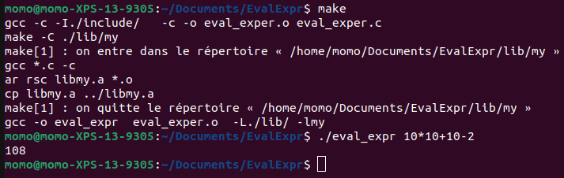

# EvalExpr

EvalExpr est un des trois projets les plus important du début d'année. Le but de ce projet est de créer une calculatrice fonctionnelle, capable d'analyser
une chaîne de donnée passée en argument et d'afficher la valeur résultante.
La difficulté va être d'effectuer les calculs suivant la logique des priorités.

## But du programme

Créer une calculatrice fonctionnelle qui doit gérer les opérateurs suivant :
	* Somme (+)
	* soustraction (-)
	* Produit (*)
	* Division (\)
	* Puissance (^)
	* Modulo (%)
	* Parenthèses ()

## Fonctions autorisées

```

	• Write 
	• Malloc
	• free
	
```

## Mise en route

Ces instructions vous permettront d'obtenir une copie du projet opérationnel sur votre machine locale à des fins de développement et de test.

### Pré-requis

De quoi avez-vous besoin pour installer le logiciel et comment l'installer ?

```

gcc
make

```

### Installation

Compilation du projet

```
make
```

Lancement du projet

```
./eval_expr
```

## Captures d'écrans

Exemple de lancement et de calcul :



